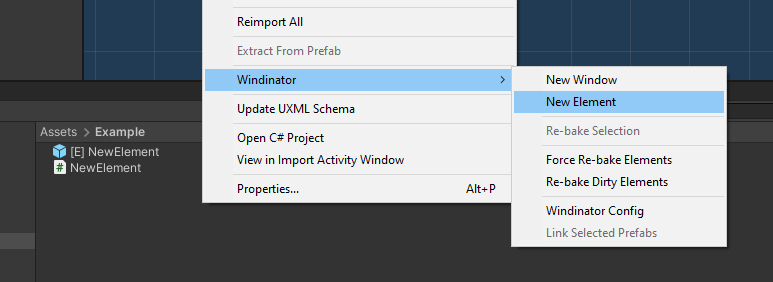

# Elements

## Creating an Element

You can use elements to build your entire or partial UI through code.



Upon creation you will have a prefab and a controller script.


The prefab will automatically be updated so you don't want to change or add any children, only the root object.
The prefab will only be updated once the script is changed. You can force an update by right clicking and selecting *Windinator/Re-Bake Selection*.

## Script skeleton

``` C#
using UnityEngine;
using Riten.Windinator;
using Riten.Windinator.LayoutBuilder;
using Riten.Windinator.Material;

using static Riten.Windinator.LayoutBuilder.Layout;

public class NewElement : LayoutBaker
{
    public override Element Bake()
    {
        return null; // Place your elements here
    }

    // Use your usual Unity callbacks if you need,
    // aka void Start(), Update(), etc.
}
```
## Element Settings


**Free Control**: If this is false, the element will be it's preffered size (the size depends on the contents), otherwise you can resize it freely and potentially make it fullscreen.

## Script References

Script references are used to store a reference to one of your elements.
All your referenced fields **MUST** have the *SerializeField* attribute or be *public* for them to work.

``` C#
using UnityEngine;
using Riten.Windinator;
using Riten.Windinator.LayoutBuilder;
using Riten.Windinator.Material;

using static Riten.Windinator.LayoutBuilder.Layout;

public class NewElement : LayoutBaker
{
    [SerializeField] MaterialLabel m_label;

    public override Element Bake()
    {
        return new MaterialUI.Label("Hello World")
                    .GetReference(out m_label);
    }
    
    void Awake()
    {
        m_label.LabelText = "Changing the label's contents from runtime";
    }
}
```