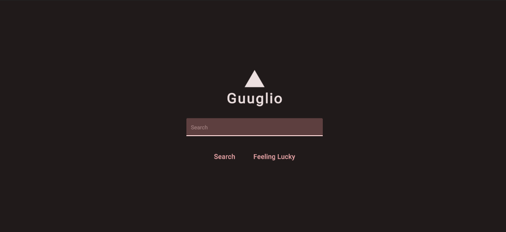

# Introduction

## What is Windinator?

Windinator is a UI framework to help you create professional and personlized user interfaces for games or applications within **Unity3D**.
It provides tools to manage window flow and navigation as well as tools to create user interfaces through code.

## Integrate in your Project

Windinator works with the built-in Unity UI system, it was built to be compatible with existing workflows and other UI tools.
You will need to have **TextMeshPro** imported inside your project since Windinator uses it for displaying text.

### What are Windows?

A window usually takes over the whole screen. When you create a window within Windinator, it will prepare a Prefab and a Script to go along side it.
The prefab will contain a normal canvas that you can customize however you see fit.
Once the window is created you can show it at runtime by simply pushing it to the stack:

```c#
Windinator.Push<Window_Type>();
```

Later, if you want to close the window you can just pop it:

```c#
Windinator.Pop();
```

### What are Elements?

Elements are optional, you can use your usual methods of creating your menus.
But in case you need a more modular, code based approach to your designs then this is for you.
Elements can be used to create smaller pieces of UI that you will manually integrate in your UI or use it inside other Elements, or fullscreen interfaces.
They will also generate a prefab that will get updated automatically when the code updates.

The syntax is very inspired by Flutter.
There is no runtime overhead to this approach, all generation happens during editor time and gets saved to a prefab that you can use.

Here is an example of what an element file looks like vs what it automatically generates:

```c#
using UnityEngine;
using Riten.Windinator;
using Riten.Windinator.LayoutBuilder;
using Riten.Windinator.Material;

using static Riten.Windinator.LayoutBuilder.Layout;

public class GoogleTemplate : LayoutBaker
{
    [SerializeField] Sprite m_logo;

    public override Element Bake()
    {
        return new Vertical(
            new Element[]
            {
                new Graphic(sprite: m_logo, color: Colors.OnBackground),

                new MaterialUI.Label(
                    "Guuglio",
                    style: MaterialSize.Headline,
                    fontStyle: TMPro.FontStyles.Bold,
                    color: Colors.OnBackground
                ),

                new Spacer(25f),
 
                new MaterialUI.InputField(
                    labelText: "Search",
                    style: MaterialTextFieldType.Filled
                ),

                new Spacer(25f),

                new Horizontal(
                    children: new Element[]
                    {
                        new MaterialUI.Button(
                            "Search",
                            type: MaterialButtonType.Text
                        ),
                        new MaterialUI.Button(
                            "Feeling Lucky",
                            type: MaterialButtonType.Text
                        )
                    },
                    alignment: TextAnchor.MiddleCenter,
                    spacing: 20f
                )
            },
            alignment: TextAnchor.MiddleCenter
        );
    }
}
```

The code above gets translated into this (with a dark theme applied):

